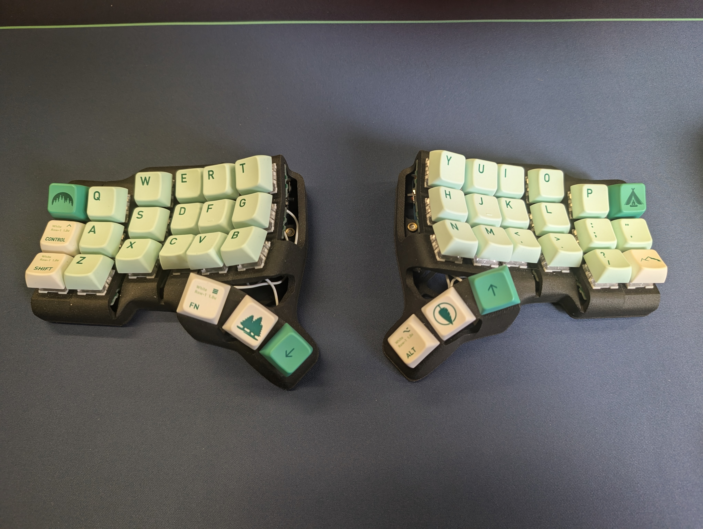

# Keyboard Layout

## Home layer

General rules in use here:

1. Avoid reaching with pinky as much as possible.
2. Bring frequently used keys as close to the home row as possible.
3. Give your thumbs something to do - each thumb has 3 keys to press!
4. Give yourself time to adjust when making changes.

|       | Pinky | Ring | Middle | Index   |       |      | Index   | Middle | Ring | Pinky |       |
| ----- | ----- | ---- | ------ | ------- | ----- | ---- | ------- | ------ | ---- | ----- | ----- |
| Esc   | Q     | W    | E      | R       | T     | Y    | U       | I      | O    | P     | Bspc  |
| Bspc  | A     | S    | D      | F       | G     | H    | J       | K      | L    | ;     | '     |
| Shift | Z     | X    | C      | V       | B     | N    | M       | ,      | .    | /     | Enter |
|       |       |      |        | [Thumb] |       |      | [Thumb] |        |      |       |       |
|       |       |      | Del    | Escape  | Enter | Bspc | Space   | Menu   |      |       |       |

## Combo keys

Frequently used key "chords"

> Caps word is like smart caps lock, it lets you TYPE-ONE-WORD in uppercase and auto swithces back.

| Key Combination | Action       |
| --------------- | ------------ |
| D + F           | Tab          |
| L + ;           | Enter        |
| , + .           | =>           |
| F + J           | Caps Word    |
| Space + Bspc    | Mouse Toggle |

## Home row modifiers | dual purpose keys

The real key for not having to reach with pinky is home row modifiers.
Each finger has dual purpose on it's home position, these are mirrored which makes it easier to remember.
Most of the thumb keys can be held to activate a different layer.
e.g. The right thumb rests on the space key, you tap it to make space characters but holding it switches to the arrows layer.

|         | Pinky     | Ring | Middle | Index   |         |     | Index   | Middle | Ring | Pinky     |         |
| ------- | --------- | ---- | ------ | ------- | ------- | --- | ------- | ------ | ---- | --------- | ------- |
|         |           |      |        |         |         |     |         |        |      |           |         |
| `Ctrl`  | **Shift** | Ctrl | Alt    | Super   |         |     | Super   | Alt    | Ctrl | **Shift** | `Ctrl`  |
| `Shift` |           |      |        |         |         |     |         |        |      |           | `Shift` |
|         |           |      |        | [Thumb] |         |     | [Thumb] |        |      |           |         |
|         |           |      | Super  | Symbols | Numbers | Alt | Arrows  | Menu   |      |           |         |

The Menu key is a special bind that activates Numbers + Super simultaneously (for desktop switching).
`Menu + q` sends `Super + 1`

---

## Layers

### Arrows Layer

Activates when right thumb holds the space key.
Most of the left hand key presses here are not used much.

|            | Pinky | Ring | Middle | Index  |        |     | Index | Middle  | Ring  | Pinky |            |
| ---------- | ----- | ---- | ------ | ------ | ------ | --- | ----- | ------- | ----- | ----- | ---------- |
| Bootloader |       |      | Vol Dn | Vol Up |        |     |       | Home    |       | End   | Bootloader |
|            |       |      | Prev   | Next   | Play   |     | Left  | Down    | Up    | Right |            |
|            | BT 0  | BT 1 | BT 2   |        | BT Clr |     |       | Pg Down | Pg Up |       |            |

### Numbers Layer

Activated with left thumb held on enter key.
The main numbers retain their position from a normal keyboard.
The right hand home row has commonly used symbols on this row to compliment their counterparts on the symbols layer.

|     | Pinky | Ring | Middle | Index |     |     | Index | Middle | Ring | Pinky |     |
| --- | ----- | ---- | ------ | ----- | --- | --- | ----- | ------ | ---- | ----- | --- |
| ~   | 1     | 2    | 3      | 4     | 5   | 6   | 7     | 8      | 9    | 0     |     |
|     | F1    | F2   | F3     | F4    | F5  | F6  | [     | ]      | \    | -     | =   |
|     | F7    | F8   | F9     | F10   | F11 | F12 | =>    |        |      |       |     |

### Symbols Layer

Activated with left thumb held on escape key.
The top row of symbols are just the shifted version of the top row of numbers.
The right hand home row has commonly used symbols on this row to compliment their counterparts on the numbers layer.
The grave symbol is duplicated here to train me to not reach with pinky.

|     | Pinky | Ring | Middle | Index |     |     | Index | Middle | Ring | Pinky |     |
| --- | ----- | ---- | ------ | ----- | --- | --- | ----- | ------ | ---- | ----- | --- |
| `   | !     | @    | #      | $     | %   | ^   | &     | \*     | (    | )     |     |
|     | `     |      |        |       |     |     | [     | ]      | \|   | \_    | +   |
|     |       |      |        |       |     |     | (     | )      |      |       |     |

### Mouse Layer

Activates by pressing Space + Backspace combo (toggle).
Mouse movement uses HJKL pattern on right hand home row, scrolling on bottom row.

|     | Pinky | Ring        | Middle       | Index      |     |     | Index       | Middle       | Ring        | Pinky        |     |
| --- | ----- | ----------- | ------------ | ---------- | --- | --- | ----------- | ------------ | ----------- | ------------ | --- |
|     |       |             |              |            |     |     | Left Click  | Middle Click | Right Click |              |     |
|     |       | Right Click | Middle Click | Left Click |     |     | Move Left   | Move Down    | Move Up     | Move Right   |     |
|     |       |             |              |            |     |     | Scroll Left | Scroll Up    | Scroll Down | Scroll Right |     |

---
